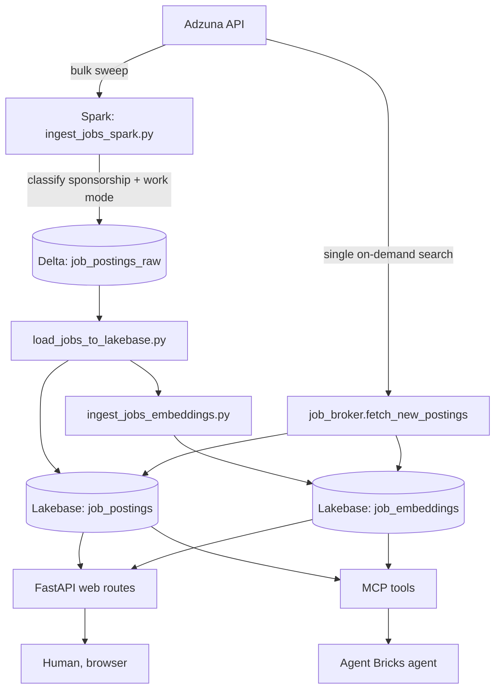
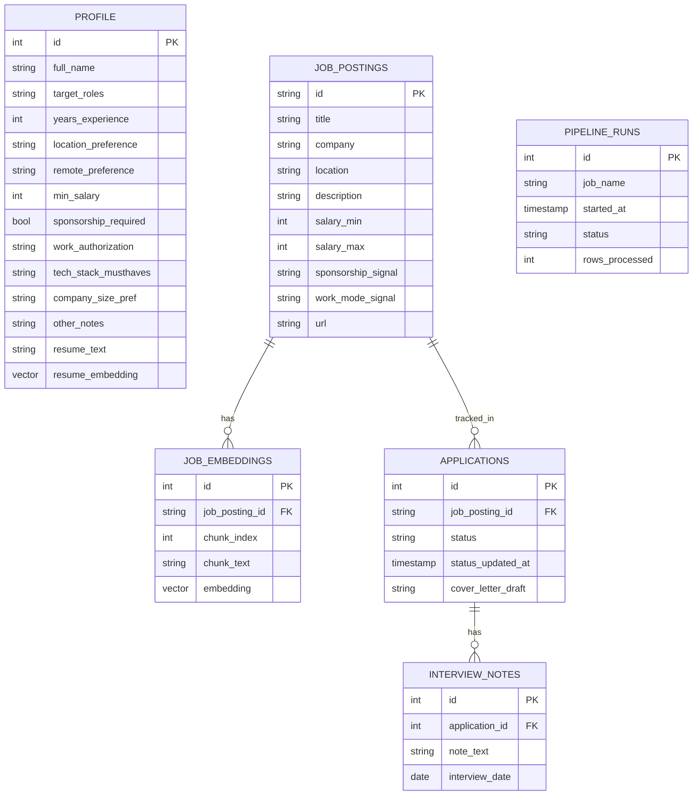

# Architecture

## Data flow

Two ingestion paths write to the same Lakebase tables, and one read path
(the app + agent) consumes them. This is the whole system:

Two things worth noticing. **Delta only appears in the bulk path**, not the
live one: a handful of on-demand postings go straight to Lakebase, since
spinning up Spark for 20 rows would be the wrong tool for the job. And
**both ingestion paths converge on the same Lakebase tables**, which is
what makes the app and the agent see consistent data no matter which path
a given posting came in through.

## Schema

`schema.sql` is the single source of truth for this. `lakebase.py` reads
and executes that file directly instead of duplicating the DDL in Python,
specifically to prevent the kind of drift that happens when the same schema
exists in two places and only one gets updated.

## Design decisions worth being able to explain

**Hard filters vs. embedded soft preferences.** Salary floor, remote/
onsite/hybrid, and sponsorship are explicit columns queried with plain SQL
`WHERE` clauses. Tech stack, company size, and free-form notes are folded
into the profile's embedding instead. The distinction: hard filters have
unambiguous values worth excluding on; soft preferences are nuanced enough
that an exact-match column would either be too strict or need a new column
for every preference anyone could ever have. Years of experience follows
the soft path on purpose. Job postings almost never state a structured
"years required" field either, so it's embedded as descriptive text
instead of built into a fragile extraction rule.

**Sponsorship filtering excludes only explicit negatives.** Most postings
never mention sponsorship either way. Filtering to only postings that
explicitly confirm sponsorship would discard the majority of viable roles;
the actual filter excludes only postings that explicitly rule it out
(`sponsorship_signal != 'no_sponsorship_stated'`), treating silence as
neutral rather than as a no.

**One Databricks App, not two.** Free Edition allows exactly one App per
account. The frontend and the MCP server therefore have to be the same
process. FastMCP's ASGI app is mounted into the FastAPI app at `/mcp`
instead of being deployed separately, which is also why the frontend is
FastAPI and not Streamlit (Streamlit doesn't expose its server for
something else to mount onto).

**Live fetch is a genuinely separate path from the Spark job, not a
shortcut around it.** The Spark pipeline is the bulk/scheduled ingestion
path, built to demonstrate distributed processing at a scale where it
matters. Single on-demand searches from the web UI skip Delta and Spark
entirely and write straight to Lakebase, since spinning up a distributed
job for twenty rows would be solving a problem that doesn't exist yet at
this data volume. Both converge on the same tables, so results are
consistent regardless of which path added them.

**Sponsorship and work-mode classification is one set of regex patterns
(`classify.py`), used two ways.** Spark applies them as column expressions
across a DataFrame; the live-fetch path applies them with `re.search` on
one string at a time. Same rules, two execution shapes, so a change to what
counts as "mentions sponsorship" only ever needs to happen in one file.

**Delta to Lakebase, not the reverse.** Databricks' more common pattern
(and the original, later-dropped, capstone CDF requirement) is Lakebase to
Delta: application-generated data flowing out to the analytical estate.
This project's data flows the other way because it originates externally,
at Adzuna, not inside Lakebase. Ingesting external data has always meant
"land it in Delta first," regardless of what direction a given app's own
generated data later needs to flow. A complete system would eventually do
both.

**Batch ingestion, explicitly not CDC.** The pipeline is scheduled/
on-demand batch extraction, not change-data-capture. It doesn't watch
Lakebase for changes, and CDF is unavailable on Free Edition. A real
incremental-extraction stretch goal (polling `status_updated_at` for
changed rows) would get closer without being true CDC, since polling still
can't see deletes or intermediate states between runs.

**Single-user, deliberately.** No `users` table, no auth. Adding
multi-tenancy later means a `users` table plus a `user_id` FK on `profile`
and `applications`. `job_postings` and `job_embeddings` are a shared
catalog and wouldn't change. The harder part of multi-tenancy is real
authentication and threading caller identity through MCP tool calls, which
is a separate project, not a schema change.

**Error handling.** Every write in `lakebase.py` goes through a
`transaction()` context manager that commits on success and rolls back on
any failure, wrapping errors as `LakebaseError` so callers never see raw
`psycopg2` tracebacks. `main.py` and the notebooks contain zero direct
database calls: `psycopg2` is imported nowhere but `lakebase.py`, checked
with a plain grep and enforced by `tests/test_architecture_invariants.py`,
not just a convention. `main.py` also registers a FastAPI exception handler
for `LakebaseError` as a safety net for routes that don't handle it
themselves, so a database hiccup renders a friendly error page instead of a
500 with a raw traceback. It never echoes the underlying exception text
into the response either, since psycopg2's own error strings can carry
connection details.

**Connection pooling.** `lakebase.py` keeps a small `ThreadedConnectionPool`
(1-5 connections) instead of opening a fresh `psycopg2.connect()` per call.
It's deliberately small, since this is a single-user app on shared,
free-tier compute where concurrency is inherently low. A connection is
validated with a cheap `SELECT 1` on checkout and discarded-and-retried
once if it turns out stale (the server closed an idle connection, or a
credential expired), which is realistic for an app that may sit idle
between requests for a while. Discarding is otherwise selective: only
`psycopg2.OperationalError` (the connection itself is suspect) causes a
connection to be dropped from the pool; an ordinary query error (a
constraint violation, bad data) leaves it safe to reuse after the caller's
own rollback.

**Semantic search ranks chunks, not postings.** `search_jobs_semantic` orders
by vector distance directly (`ORDER BY embedding <=> vector LIMIT`) and
dedupes to one row per posting in Python afterward, keeping the
best-scoring chunk. The alternative, collapsing to one row per posting with
`DISTINCT ON (id)` before ranking, forces Postgres to sort by posting id
first and similarity second. That both breaks top-k ranking (you'd get the
postings with the lowest ids, not the best matches) and makes the HNSW
vector index unusable, since it can only serve a query whose `ORDER BY`
leads with the distance expression it was built on.

**Cover letter drafting calls the AI Gateway directly.** The Databricks SDK's
`serving_endpoints.get_open_ai_client()` targets the older per-endpoint
serving route, which stopped covering the pay-per-token foundation models
once this workspace migrated to the unified AI Gateway (`/ai-gateway/mlflow/v1/chat/completions`).
`draft_cover_letter()` calls that route with `requests`, authenticated via
`WorkspaceClient().config.authenticate()`, so the app still never manages
a raw token itself.
